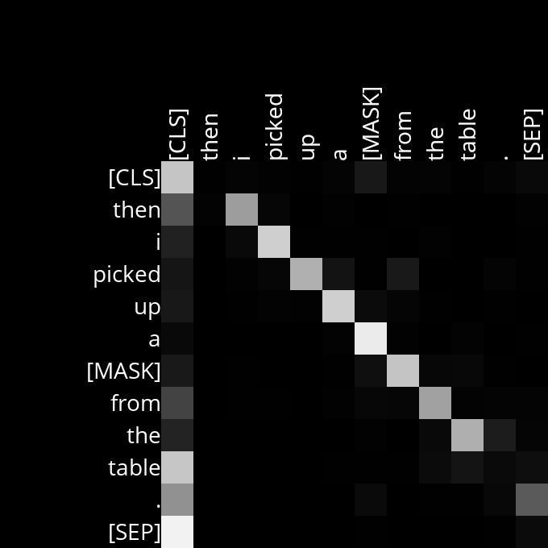

# Analysis

## Layer 2, Head 2

Every word pays attention to the word next to it, except [SED] pays attention to [CLS]

Example Sentences:
- Then I picked up a book from the table.
- Then I picked up a bottle from the table.
- Then I picked up a plate from the table.
